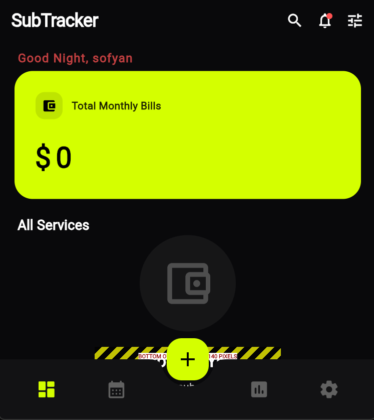
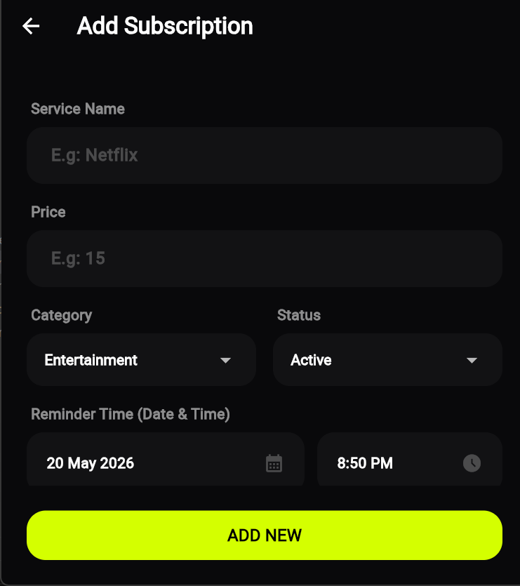

# 🚀 SubTracker - Smart Subscription Manager

**SubTracker** adalah aplikasi pintar berbasis *Offline-First* yang dirancang untuk membantu pengguna mencatat, memantau, dan mengingatkan jadwal pembayaran tagihan langganan bulanan (seperti Netflix, Spotify, Internet, dll) secara terorganisir dan tepat waktu.

Aplikasi ini dikembangkan untuk memenuhi standar UI/UX yang elegan—tidak terlalu sederhana, namun tidak terlalu ramai—dengan fungsionalitas pengingat lokal (Alarm/Notifikasi) tanpa mengorbankan privasi pengguna.

---

## 📸 Cuplikan Layar & Penjelasan UI (Screenshots)
*Bukti implementasi antarmuka (UI) yang elegan, modern, dan seimbang.*

### 1. Layar Animasi Sambutan (Welcome Screen)

  

> **Penjelasan Tampilan:** Gambar ini menangkap momen transisi animasi selamat datang bagi pengguna. Teks sapaan ditampilkan secara dinamis menggunakan efek mesin ketik (*typewriter effect*) huruf demi huruf, lengkap dengan kursor yang berkedip. Perpaduan gaya huruf miring/kursif yang elegan (putih) dengan nama aplikasi yang tebal (kuning neon) pada latar belakang gelap memberikan kesan antarmuka yang sangat modern, eksklusif, dan premium.

### 2. Dashboard Utama (Home)

  

> **Penjelasan Tampilan:** Mengusung perpaduan warna *Dark Mode* (Hitam pekat) dan aksen kuning neon. Bagian atas menampilkan sapaan pengguna dan total akumulasi tagihan bulanan. Bagian tengah menampilkan kartu peringatan "Segera Jatuh Tempo", disusul dengan daftar *list* langganan yang aktif. Dilengkapi *Bottom Navigation Bar* untuk perpindahan menu yang mulus.

### 3. Formulir Tambah Langganan (Add Subscription)

  

> **Penjelasan Tampilan:** Layar ini dirancang anti-berantakan saat *keyboard* muncul. Input data disusun rapi ke dalam kotak-kotak bersudut melengkung (*rounded corners*). Pengguna dapat memilih layanan, memasukkan nominal harga, mengatur kalender jatuh tempo, hingga memilih jenis peringatan (Notifikasi Biasa atau Alarm Berdering).

---

## 📋 Blueprint & Tema Aplikasi
- **Nama Aplikasi:** SubTracker
- **Tema:** Keuangan & Productivity (Subscription Manager & Reminder).
- **Target Pengguna:** Individu yang memiliki banyak layanan langganan digital dan sering lupa tanggal jatuh tempo.
- **Arsitektur:** *Offline-First* (Penyimpanan lokal dengan *SharedPreferences* dan sistem *Local Notifications*).

---

## ✨ Daftar Fitur Utama (Features)

1. **🌟 Onboarding & Profiling yang Elegan**
   - Layar *Welcome* sinematik dengan pemisahan *User Flow* (Pengguna baru melalui form perkenalan, pengguna lama langsung disapa dengan nama dan masuk ke Dashboard).
   - *Staggered Album Background* dengan fokus pada layar aplikasi layanan populer (Spotify/Netflix).

2. **📊 Dashboard Interaktif (Home)**
   - Ringkasan total tagihan bulanan.
   - Indikator peringatan untuk tagihan di bawah 7 hari.
   - Daftar layanan aktif dengan filter pengurutan (Terdekat, Termahal, Termurah, A-Z).

3. **📅 Kalender Tagihan Terintegrasi**
   - Visualisasi tanggal jatuh tempo dengan indikator titik kuning di kalender.
   - Pendeteksi hari libur nasional otomatis (Indonesia).

4. **📈 Statistik & Proyeksi Pengeluaran**
   - Analisis pengeluaran berdasarkan kategori (Hiburan, Software, Utilitas) menggunakan persentase *Progress Bar*.
   - Kalkulasi proyeksi total pengeluaran tahunan.

5. **🔔 Smart Notification & Alarm System**
   - Menggunakan `flutter_local_notifications`.
   - Mendukung penjadwalan alarm presisi tinggi.
   - Opsi *Alarm Berdering* atau *Notifikasi Biasa* saat tagihan jatuh tempo.

6. **⚙️ Personalisasi (Multi-Tema & Multi-Bahasa)**
   - **Tema:** Hitam, Putih, dan Biru.
   - **Bahasa:** Indonesia (ID) dan English (EN).

---

## 🛠️ Dokumentasi Cara Kerja Aplikasi

Berikut adalah alur penggunaan aplikasi SubTracker:

1. **Memulai Aplikasi (Awal)**
   - **Pengguna Baru:** Dihadapkan pada halaman pemilihan Bahasa, Persetujuan Syarat & Ketentuan, dilanjutkan dengan animasi Welcome polos yang diketik secara halus. Setelah menekan "Mulai Sekarang", pengguna mengisi Form Profil (Nama & Anggaran).
   - **Pengguna Lama:** Melewati semua proses di atas dan langsung melihat layar sapaan "Selamat Datang Kembali, [Nama]" untuk langsung masuk ke Dashboard.
2. **Manajemen Tagihan**
   - Pengguna menekan tombol **(+)** warna neon di tengah bawah untuk menambah layanan.
   - Pengguna mengisi formulir harga, nama layanan, dan menentukan **Tanggal & Waktu Pengingat** kapan notifikasi harus berbunyi.
   - Data disimpan ke dalam memori internal (`SharedPreferences`).
3. **Eksekusi Pengingat**
   - Pada waktu yang ditentukan, OS perangkat (Android/iOS) akan memicu notifikasi atau alarm berdering untuk mengingatkan tagihan.
   - Pengguna membuka aplikasi, menekan langganan tersebut, lalu memilih opsi **"Tandai Sudah Selesai"** atau **"Perpanjang Langganan"** (memasukkan jumlah bulan perpanjangan).

---

## 📌 Status Kepatuhan Syarat Proyek (Checklist)
Sesuai dengan pedoman tugas/pengembangan aplikasi:

- [x] Menentukan Tema/Nama Aplikasi.
- [x] Membuat Blueprint sebagai acuan pengembangan.
- [x] Awal Proyek sudah disikronisasi dengan GIT.
- [x] Setiap perubahan dalam proyek harus diuji coba dan dikirim ke GIT.
- [x] Tidak diperkenankan melakukan 1x Git Push selama masa pengembangan aplikasi atau di akhir. *(Terbukti dari history commit di repository ini)*.
- [x] Minimal 1 minggu sekali melakukan update aplikasi ke GIT dengan catatan lengkap pada git.
- [x] Layout (UI) aplikasi wajib elegan, tidak sangat sederhana dan tidak ramai. *(Telah diimplementasikan dan ditunjukkan pada cuplikan layar di atas)*.
- [x] Berikan dokumentasi cara kerja aplikasi dan daftar fitur di dalam proyek berupa file README.md. *(Terdapat pada file ini)*.
- [ ] H - 2 Minggu sebelum pelaksanaan UAS Aplikasi sudah didaftarkan ke Google Play Store atau Apple App Store. *(Dalam proses)*.
